# Gateway Uplink Stats App - Cisco IR 8XX Series 

Cisco IoT Gateway Stats Microservice - This Golang app provides a HTTP GET API call that returns Cellular Stats for Dual LTE and/or Single LTE and/or WiFi Connected Uplink stats for IR 800 Series Cisco IoT Routers.  It also return GPS data as well. This has a lot of use for tracking connection stats for fail over connectivity or connection activity, even if internet has been disconnected for any reason.

> Note: To make this work properly you will need to speak with your Kinetic rep to apply the correct configuration to your gateways.

## Working Platforms

This has only been tested on most of the Cisco IR 829 platforms.  However, it can potentially work with the IR 809 platform as well, but remains untested on IR 809 series gateways for now.

## Deploying the applications

### Download the app package.
You can download the Cisco IOx app package from here https://github.com/CiscoDevNet/gw_uplink_stats/releases/download/v0.8.7/package.tar.gz.

### Cisco Kinetic App Deploy
Assuming you downloaded the application... 

* you will need to login to the https://us.ciscokinetic.io portal

* Click on the **Applications** Menu button

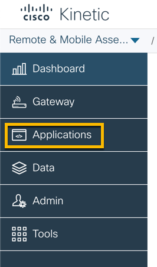

* Next click on **Add Application**

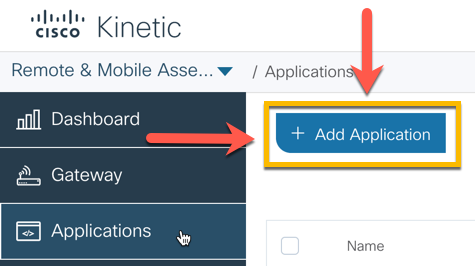

* Load your application package.tar.gz file and click the install button

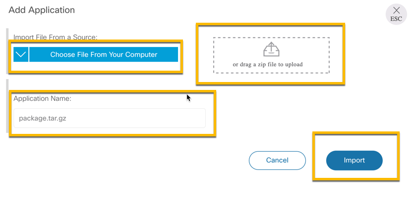

* Your app will load up fairly quickly, depending on your connection.

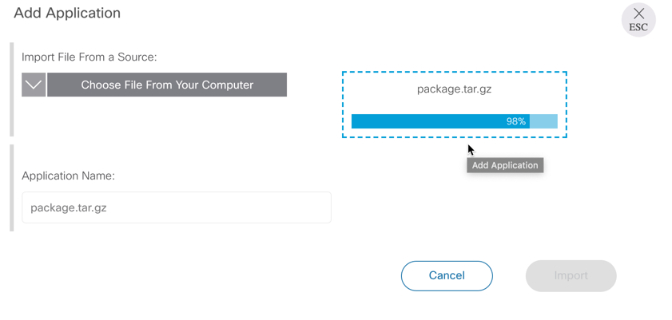

* Click on the **GW Connection Service** App.  Depending on your setup you will probably only see one application.  If you have more than one application the picture below will depict something similar to what you will see for your available applications.

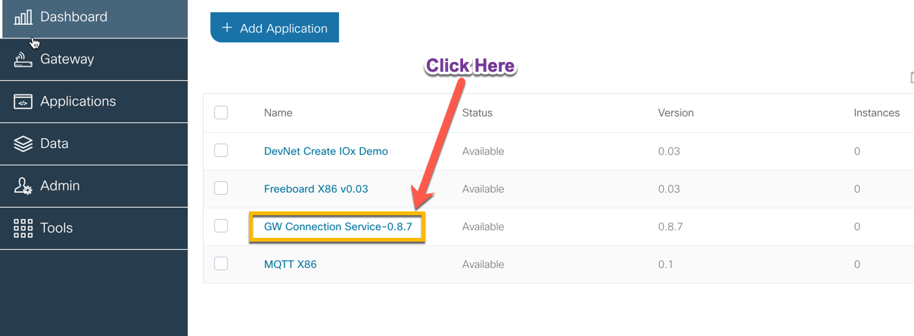

* Next Click the install button

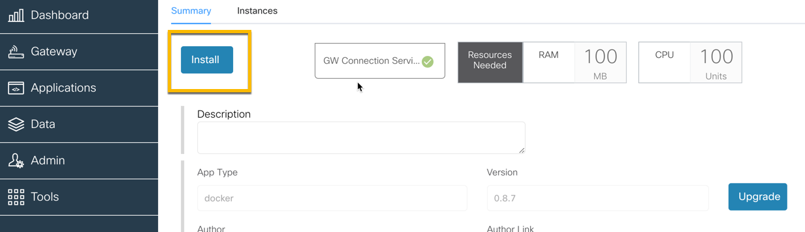

* Choose one of the gateways available to you

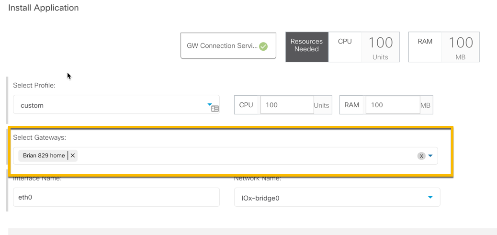

* Click the drop down menu for **Application Specific Parameters**

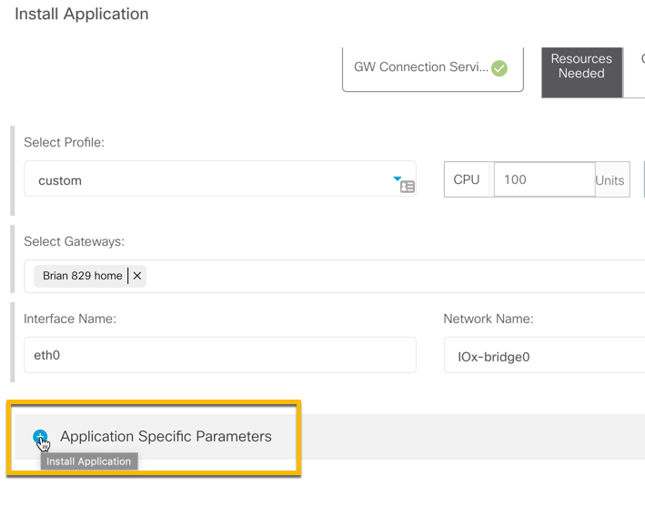

* Expand all of the subsequent drop down menus and fill in all of the required fields.  This will populate the app with the appropriate parameters at application runtime. This can also be accomplished through the Cisco Kinetic RESTful API, but for simplicity we are using the Web GUI to accomplish these tasks.  Click the **Install** button once you are finished populating the appropriate parameters

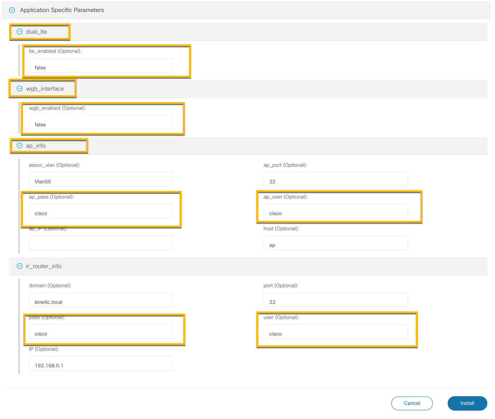

* Hover your mouse over the **Gateway** menu button and then select **Gateways** from the popup menu.  Once you have done that, click on the Gateway you installed the app on.

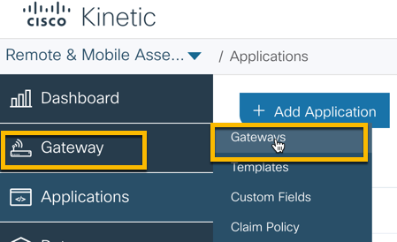

* Click on the Apps tab

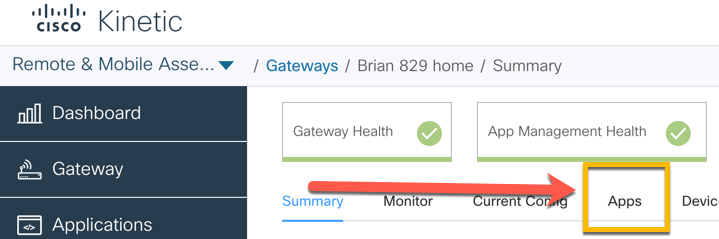

* Wait for the App to become fully operational.  You screen will look similar to the following image when it is installed on your gateway.

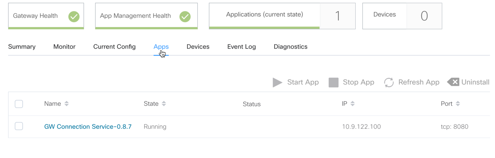

* At this point you, if you are connected to the IR 829 over ethernet, you can go to http://192.168.0.1:8080/api/gw_stats to view the Gateway connection / uplink stats.  If you are connected over VPN from the Kinetic Cloud, you can use the IP address you see assigned to your application on port 8080, e.g. http://10.x.x.x:8080/api/gw_stats.

### FND w/ Fog Director APIs App Deploy

No instructions at this time...

## Building the application

### Build Instructions coming soon.

> Pre-requisites: You will need Docker installed on your computer and you will need the ioxclient found here https://developer.cisco.com/docs/iox/#!iox-resource-downloads/downloads.

